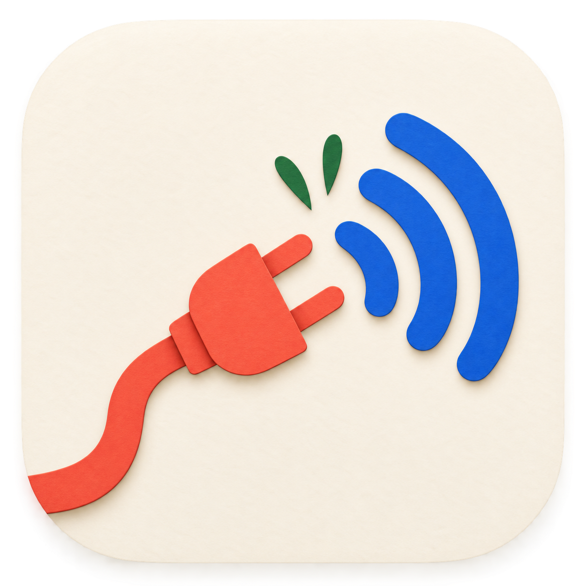

<p align="center">
  
</p>

<h1 align="center">Uncordex</h1>

<p align="center">
  A native macOS controller that disconnects one Bluetooth speaker when your saved desk setup departs and restores only the connection it previously disconnected.
</p>

<p align="center">
  macOS 13+ · Apple Silicon and Intel · MIT licensed
</p>

Uncordex combines a native AppKit app with a small per-user LaunchAgent. It runs locally, stores its configuration on the Mac, and uses [blueutil](https://github.com/toy/blueutil) to control a speaker that is already paired.

It has no account, cloud service, telemetry, automatic pairing, Bluetooth-radio control, audio-output switching, or system daemon.

## What it does

1. You choose one paired Bluetooth speaker.
2. You choose when reconnection is allowed: a saved source, any external power, or never.
3. Uncordex watches power and source identity in the background.
4. When it confirms a departure, it disconnects the speaker and records that it owns that action.
5. When the selected setup returns, it reconnects only if that ownership is still valid.

Manual connections and disconnections remain respected. Uncordex does not continually force the speaker into a preferred state.

## Reconnection rules

- **Saved source — recommended:** reconnect only while AC is present and a saved Thunderbolt/USB4 dock, serialized USB hub, or serialized power adapter matches.
- **Any external power:** reconnect after any observed battery-to-AC return. Choose this only when every charger is acceptable.
- **Disconnect only:** disconnect on departure and never reconnect automatically.

A saved dock is a presence rule. If another charger already keeps the Mac on AC, attaching the saved dock can still make restoration eligible. A different charger cannot satisfy a saved-source rule.

## Requirements

- macOS 13 or newer.
- Apple Silicon or Intel Mac.
- One Bluetooth speaker already paired with the Mac.
- A logged-in macOS user session.
- Homebrew and `blueutil`.

Install the external helper with:

```bash
brew install blueutil
```

## Install the app

The macOS package places `Uncordex.app` in `/Applications`. Open the app, select **Speaker & Rule**, choose the paired speaker and reconnection rule, preview the result, then select **Save & Start**.

The package installs only the app. It does not start a service, operate Bluetooth, install Homebrew packages, or change the current user's configuration. Existing configuration, state, logs, and LaunchAgent files are preserved during upgrades.

See [macOS installer package](docs/pkg.md) for building, signing, validation, installation, and removal. The existing GitHub `v1.0.0` release has no installer attached; publishing a downloadable package requires a package built from the matching release commit.

## Install from source

Connect the dock or charger that should qualify restoration, then discover whether macOS exposes a stable identity:

```bash
git clone https://github.com/magrathean-uk/uncordex.git
cd uncordex
brew install blueutil
./install.sh --discover
```

Discovery is read-only. It does not install a service or operate Bluetooth.

Start guided setup with the speaker's Bluetooth address:

```bash
./install.sh AA-BB-CC-DD-EE-FF
```

For noninteractive setup, choose a rule explicitly:

```bash
./install.sh AA-BB-CC-DD-EE-FF --source SOURCE_KEY
./install.sh AA-BB-CC-DD-EE-FF --any-power
./install.sh AA-BB-CC-DD-EE-FF --disconnect-only
```

Preview a source installation without package installation, persistent writes, service changes, or Bluetooth actions:

```bash
./install.sh AA-BB-CC-DD-EE-FF --source SOURCE_KEY --dry-run
```

## Background behavior

- Samples power and source identity every five seconds.
- Requires two valid observations to confirm a saved source's disappearance or return.
- Disconnects a connected speaker after a confirmed departure.
- Creates restore permission only after the disconnect succeeds and a fresh query verifies the speaker is disconnected.
- Attempts at most six reconnections in a five-minute eligible-return window, with bounded backoff.
- Fails closed on unknown hardware readings, malformed state, changed rules, and reboot.
- Retains same-boot pending state across a service restart only after fresh observations.

## Status and removal

The app's **Overview** shows service state, saved setup, current power/source readings, and automatic restore state. **Diagnostics** shows cached watcher observations, dependency status, and log access.

The same information is available from the installed service:

```bash
~/.local/share/uncordex/watch-power --status
launchctl print "gui/$(id -u)/uk.magrathean.uncordex.watch-power"
tail -f ~/Library/Logs/uncordex.log
tail -f ~/Library/Logs/uncordex-error.log
```

Use the app's **Stop** control to stop the service while preserving its files. To stop the canonical LaunchAgent and remove its property list:

```bash
./uninstall.sh
```

Removing the app or LaunchAgent leaves configuration, runtime state, backups, and logs available for recovery.

## Documentation

- [Install the app or service](docs/installation.md)
- [Use Uncordex](docs/usage.md)
- [Native macOS app](docs/app.md)
- [macOS installer package](docs/pkg.md)
- [Migrate from older watchers](docs/migration.md)
- [Troubleshooting](docs/troubleshooting.md)
- [Architecture](docs/architecture.md)
- [Development and verification](docs/development.md)
- [Release process](docs/releasing.md)
- [Live hardware and package acceptance](docs/testing/2026-09-09-live-acceptance.md)
- [Contributing](CONTRIBUTING.md)
- [Security policy](SECURITY.md)
- [Changelog](CHANGELOG.md)
- [MIT License](LICENSE)
- [Third-party notices](THIRD_PARTY_NOTICES.md)

## Verification boundary

The automated suites use fixture hardware snapshots and substituted Bluetooth, clock, process, and LaunchAgent boundaries. They verify deterministic behavior without touching the user's devices or service. They do not prove that a particular Mac, dock, charger, or Bluetooth speaker will accept a real connection.

The recorded [live acceptance run](docs/testing/2026-09-09-live-acceptance.md) proves one Bose/ASUS setup on one Mac. macOS 13 runtime compatibility, Intel runtime compatibility, sleep/wake, reboot/login, and other hardware combinations remain separate acceptance work.
